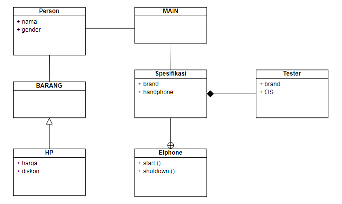
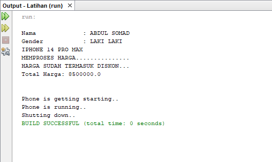
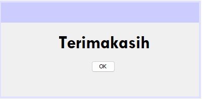

# ProjectUAS
<p><b> Nama    :   Afra Nesya Apriyanthi </p>
<p><b> NIM     :   312110614 </p>
<p><b> Kelas   :   TI.21.C1 </p>
<p><b> Mata Kuliah : Pemrograman Orientasi Objek</p>
<p><b> Project UAS </p>


<p> Berikut adalah diagram yang akan dibuat </p>



Langkah pertama akan membuat Person.java

```java
public class Person {
    public String nama;
    public String gender;
    // overload Constructor
    public Person (String nama, String gender){
        this.nama = nama;
        this.gender = gender;
    }


    public String getNama() {
        return nama;
    }

    public String getGender() {
        return gender;
    }


    // Overriding
    public void display (){
        System.out.println("\nNama \t\t : " +getNama());
        System.out.println("Gender \t\t : " +getGender());
    }
}
```

selanjutnya membuat java baru dengan nama Barang.java

```java
public abstract class Barang {
    String color;
    
    public void setColor(String color) {
        this.color = color;
    }

    public String getColor() {
        return this.color;
    }
    
    public abstract void draw();
    public abstract float total();
}
```

membuat Hp.java

```java
public class Hp extends Barang {
    int harga;
    int diskon;

    public Hp(int harga, int diskon){
        this.harga = harga;
        this.diskon = diskon;
    }

    public float total() {
        return (float) (harga - diskon);
    }

    public void draw(){
        System.out.println("IPHONE 14 PRO MAX");
        System.out.println("MEMPROSES HARGA...............");
        System.out.println("HARGA SUDAH TERMASUK DISKON...");
    }
}
```

membuat Spesifikasi.java

```java
public class Spesifikasi {
    public String brand;
    public Tester handPhone;

    public Spesifikasi(String merkBrand, String OS){
        handPhone = new Tester();
        handPhone.brand = merkBrand;
        handPhone.OS = OS;
    }

    public void start(){
        handPhone.start();
    }

    public void shutdown(){
        handPhone.shutdown();
    }

    public void run(){
        System.out.println("Phone is running..");
    }
}

```

membuat Tester.java

```java
public class Tester implements EIPhone {
    public String brand;
    public String OS;

    @Override
    public void start(){
        System.out.println("Phone is getting starting..");
    }
    @Override
    public void shutdown(){
        System.out.println("Shutting down..");
    }
}
```

membuat EIPhone.java

```java
public interface EIPhone {
    public void start();
    public void shutdown();
}
```

membuat Main.java

```java
public class Main {
    public static void main(String[] args) {
        Person person1 = new Person("ABDUL SOMAD", "LAKI LAKI");
        person1.display();
		
		// buat object dari class Barang
        Barang hp = new Hp(9000000, 500000);
        //memanggil method gambar
        hp.draw();

        //mencetak hasil dari class hp
        System.out.println("Total Harga: " + hp.total());
        System.out.println();
        System.out.println();
		
		
		//membuat object dari class spesifikasi hp
        Spesifikasi egssy = new Spesifikasi("IPhone 14 Pro Max ", "Bionic A16");

        //memanggil attribut dan nilai
        egssy.brand = "IPhone 14";
        egssy.start();
        egssy.run();
        egssy.shutdown();
    }
}
```

<p> Jika dirunning akan menjadi seperti ini </p>




Dan script untuk membuat GUI Sederhananya adalah, membuat Tutup.java

```java
public class Tutup extends javax.swing.JFrame {

    /**
     * Creates new form Tutup
     */
    public Tutup() {
        initComponents();
    }

    /**
     * This method is called from within the constructor to initialize the form.
     * WARNING: Do NOT modify this code. The content of this method is always
     * regenerated by the Form Editor.
     */
    @SuppressWarnings("unchecked")
    // <editor-fold defaultstate="collapsed" desc="Generated Code">//GEN-BEGIN:initComponents
    private void initComponents() {

        jPanel1 = new javax.swing.JPanel();
        jPanel2 = new javax.swing.JPanel();
        jTextField1 = new javax.swing.JTextField();
        jButton1 = new javax.swing.JButton();

        setDefaultCloseOperation(javax.swing.WindowConstants.EXIT_ON_CLOSE);
        getContentPane().setLayout(null);

        jPanel1.setBackground(new java.awt.Color(204, 204, 255));

        javax.swing.GroupLayout jPanel1Layout = new javax.swing.GroupLayout(jPanel1);
        jPanel1.setLayout(jPanel1Layout);
        jPanel1Layout.setHorizontalGroup(
            jPanel1Layout.createParallelGroup(javax.swing.GroupLayout.Alignment.LEADING)
            .addGap(0, 400, Short.MAX_VALUE)
        );
        jPanel1Layout.setVerticalGroup(
            jPanel1Layout.createParallelGroup(javax.swing.GroupLayout.Alignment.LEADING)
            .addGap(0, 40, Short.MAX_VALUE)
        );

        getContentPane().add(jPanel1);
        jPanel1.setBounds(0, 0, 400, 40);

        jPanel2.setPreferredSize(new java.awt.Dimension(0, 260));

        jTextField1.setBackground(new java.awt.Color(240, 240, 240));
        jTextField1.setFont(new java.awt.Font("Tw Cen MT", 1, 36)); // NOI18N
        jTextField1.setHorizontalAlignment(javax.swing.JTextField.CENTER);
        jTextField1.setText("Terimakasih");
        jTextField1.setBorder(null);
        jTextField1.addActionListener(new java.awt.event.ActionListener() {
            public void actionPerformed(java.awt.event.ActionEvent evt) {
                jTextField1ActionPerformed(evt);
            }
        });

        jButton1.setText("OK");

        javax.swing.GroupLayout jPanel2Layout = new javax.swing.GroupLayout(jPanel2);
        jPanel2.setLayout(jPanel2Layout);
        jPanel2Layout.setHorizontalGroup(
            jPanel2Layout.createParallelGroup(javax.swing.GroupLayout.Alignment.LEADING)
            .addGroup(jPanel2Layout.createSequentialGroup()
                .addContainerGap(115, Short.MAX_VALUE)
                .addGroup(jPanel2Layout.createParallelGroup(javax.swing.GroupLayout.Alignment.LEADING)
                    .addGroup(javax.swing.GroupLayout.Alignment.TRAILING, jPanel2Layout.createSequentialGroup()
                        .addComponent(jTextField1, javax.swing.GroupLayout.PREFERRED_SIZE, javax.swing.GroupLayout.DEFAULT_SIZE, javax.swing.GroupLayout.PREFERRED_SIZE)
                        .addGap(104, 104, 104))
                    .addGroup(javax.swing.GroupLayout.Alignment.TRAILING, jPanel2Layout.createSequentialGroup()
                        .addComponent(jButton1)
                        .addGap(174, 174, 174))))
        );
        jPanel2Layout.setVerticalGroup(
            jPanel2Layout.createParallelGroup(javax.swing.GroupLayout.Alignment.LEADING)
            .addGroup(jPanel2Layout.createSequentialGroup()
                .addGap(26, 26, 26)
                .addComponent(jTextField1, javax.swing.GroupLayout.PREFERRED_SIZE, 36, javax.swing.GroupLayout.PREFERRED_SIZE)
                .addGap(18, 18, 18)
                .addComponent(jButton1)
                .addContainerGap(177, Short.MAX_VALUE))
        );

        getContentPane().add(jPanel2);
        jPanel2.setBounds(0, 36, 400, 280);

        pack();
    }// </editor-fold>//GEN-END:initComponents

    private void jTextField1ActionPerformed(java.awt.event.ActionEvent evt) {//GEN-FIRST:event_jTextField1ActionPerformed
        // TODO add your handling code here:
    }//GEN-LAST:event_jTextField1ActionPerformed

    /**
     * @param args the command line arguments
     */
    public static void main(String args[]) {
        /* Set the Nimbus look and feel */
        //<editor-fold defaultstate="collapsed" desc=" Look and feel setting code (optional) ">
        /* If Nimbus (introduced in Java SE 6) is not available, stay with the default look and feel.
         * For details see http://download.oracle.com/javase/tutorial/uiswing/lookandfeel/plaf.html 
         */
        try {
            for (javax.swing.UIManager.LookAndFeelInfo info : javax.swing.UIManager.getInstalledLookAndFeels()) {
                if ("Nimbus".equals(info.getName())) {
                    javax.swing.UIManager.setLookAndFeel(info.getClassName());
                    break;
                }
            }
        } catch (ClassNotFoundException ex) {
            java.util.logging.Logger.getLogger(Tutup.class.getName()).log(java.util.logging.Level.SEVERE, null, ex);
        } catch (InstantiationException ex) {
            java.util.logging.Logger.getLogger(Tutup.class.getName()).log(java.util.logging.Level.SEVERE, null, ex);
        } catch (IllegalAccessException ex) {
            java.util.logging.Logger.getLogger(Tutup.class.getName()).log(java.util.logging.Level.SEVERE, null, ex);
        } catch (javax.swing.UnsupportedLookAndFeelException ex) {
            java.util.logging.Logger.getLogger(Tutup.class.getName()).log(java.util.logging.Level.SEVERE, null, ex);
        }
        //</editor-fold>

        /* Create and display the form */
        java.awt.EventQueue.invokeLater(new Runnable() {
            public void run() {
                new Tutup().setVisible(true);
            }
        });
    }

    // Variables declaration - do not modify//GEN-BEGIN:variables
    private javax.swing.JButton jButton1;
    private javax.swing.JPanel jPanel1;
    private javax.swing.JPanel jPanel2;
    private javax.swing.JTextField jTextField1;
    // End of variables declaration//GEN-END:variables
}
```
<p> Maka hasil outputnya GUInya adalah<p/>


